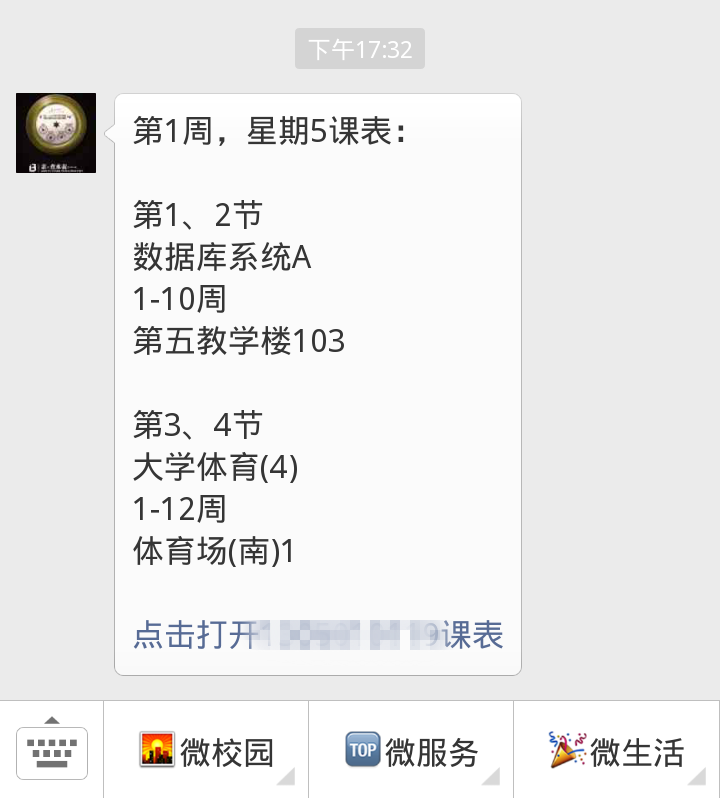
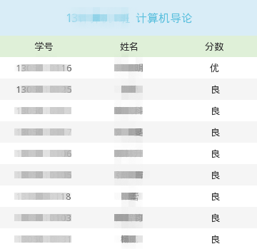
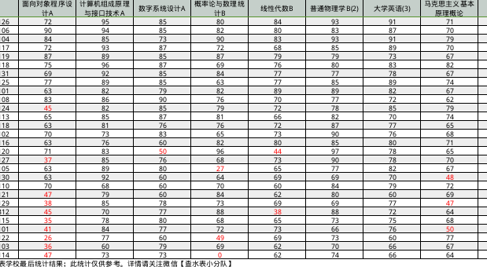
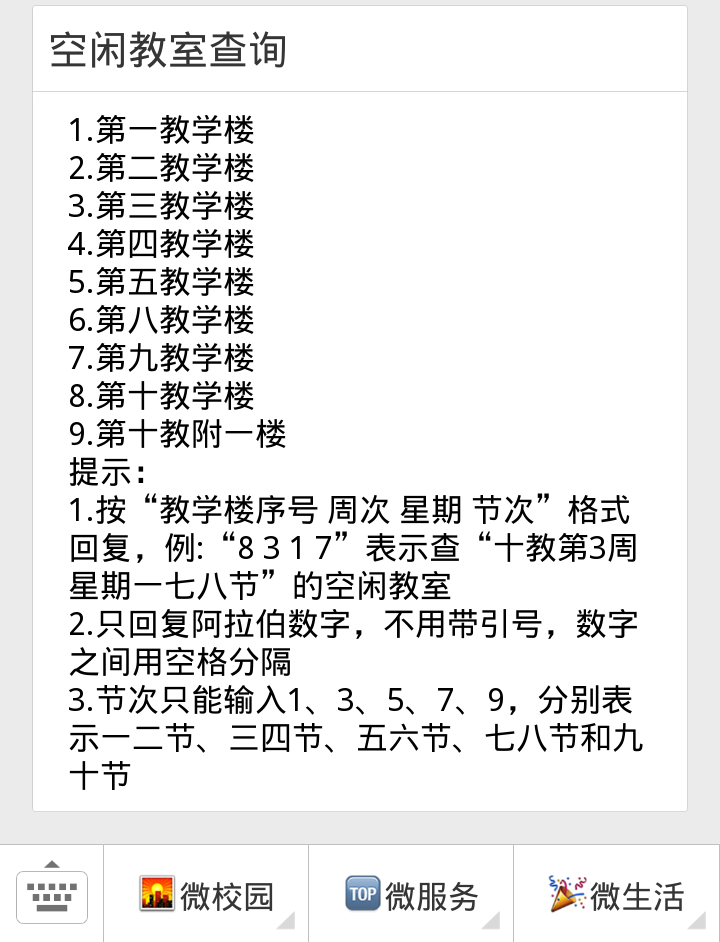
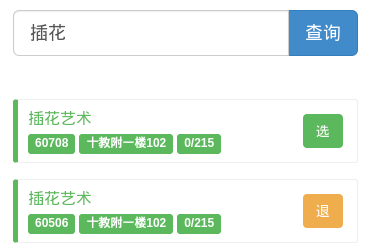
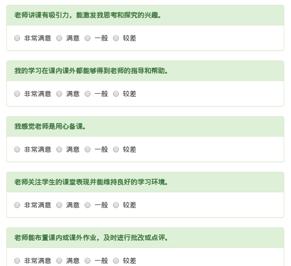
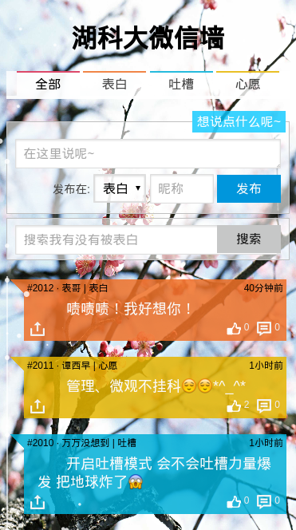
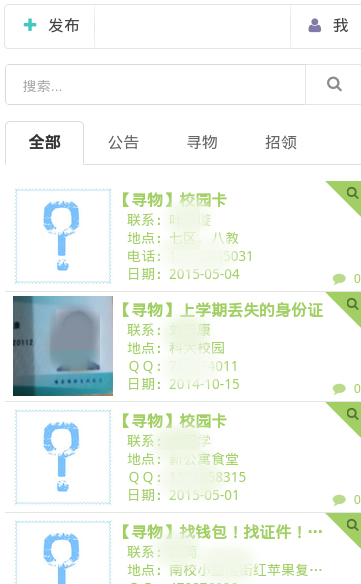
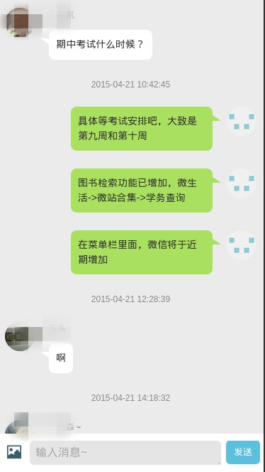
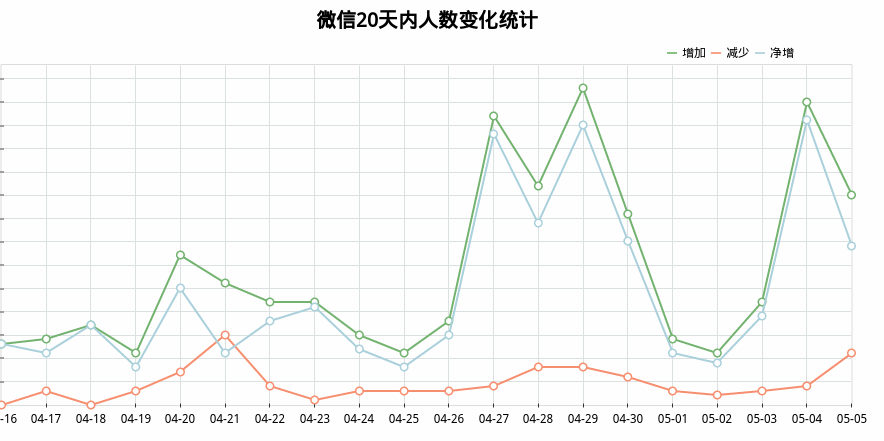

### 湖南科技大学微信公众平台
---

#### 微信功能列表

* 查询
    * `成绩查询`
    * `实时课表`
    * 学分绩点
    * 学年学费
    * 考试安排
    * `空闲教室`
    * 学期、学年排名
    * 四六级成绩
    * `一卡通查询`
    * 校历查询
* 娱乐
    * 笑话
    * `表白墙`
    * 聊天机器人（支持语音聊天）
    * 心理小测试
    * 微信小游戏
    * 科大漂流瓶
    * 百科知识答题
    * 词霸每日一句
    * 历史上的今天
    * 真心话大冒险
    * 人脸识别、人脸相似度对比
* 工具
    * `教学评价`
    * 图书检索
    * 图书续借
    * `失物招领`
    * 补考报名
    * 选修课报名
    * 快递、天气
    * 科大三维地图（利用校园地图）

---

#### 微信功能说明

* 便捷的查询功能：
    * 大多数查询`只需一步`即可取得想要的结果，一切从简

* 简化显示结果：
    * 功能列表只显示热门或常用的功能，其他功能可通过全部功能列表找到，方便查找想要的功能
    * 课表查询时自动输出`当日课表`，详细课表则通过网页查询
    * 考试安排则只保留`最近一次`的考试安排情况
    * 微信、网页同步显示，哪个方便用哪个

* 方便的设置与提醒功能
    * 不想考试期间刷考试成绩煎熬？ 没问题，`成绩提醒`功能帮你解决，成绩出来第一时间提示你
    * 成绩显示所有学期太繁琐？ 没问题，个人中心可以设置显示全部 OR 只显示当前学年 OR 只显示当前学期
    * 不想每日查看课表的痛苦？ 没问题，个人中心设置每日`课表提醒`
    * 图片太多，流量伤不起？ 没问题，设置一下 `无图模式` 瞬间去掉所有无关的微信图片
    * 还想要天气提醒.....? 可以有，一切提醒都在个人中心设置
    * PS:由于微信限制，提醒需要48小时之内活跃用户才能使用，不过别担心，快接近48小时时我们会主动提示你

* 丰富的娱乐工具：
    * 无聊时看看笑话，跟小机器人聊天解闷，更有心理小测试让你了解不一样的自己
    * 百科知识让你一站到底，丰富学识！词霸每日一句轻松学英语
    * "历史上的今天"让你看不同的今时与往日
    * 真心话大冒险题库，让你的游戏更加刺激

---

#### 人性化的设计及详细功能介绍
* 实时课表：微信查询时自动显示当日课表，跳转到网页显示时亦可下载为excel格式，方便了同学课表的查看、打印与分享

  

* 考试成绩：按学期分块，补考或挂科高亮显示。当然如果你不想自己的成绩被他人(包括班长)查询，可以选择`隐藏成绩`
* 全班/专业成绩：可按学号或分数排序，方便了解全班挂科情况，亦可下载为图片(班长或团支书申请并通过后可查看全班成绩)

  

* 考试安排：获取所有考试结果，且自动截取最近的考试安排，所有数据均来自教务网
* 学分绩点：结果高亮显示，可按任意方式排序
* 排名：排名按人数可分为，`个人排名`、`班级排名`、`专业排名`，按时间可分为，`学期排名`，`学年排名`，排名结果去除了补考成绩，同时考虑了缓考成绩，排名结果可以按总分、学分绩点、学分绩等方式排序，并且可以将排名结果`下载为excel`(显示详细结果)。（排名需要班长或团长书总支等较高权限用户才能使用）

  

* 学年学费：显示所有学期的详细学费情况，及了解下一学年应缴的学费
* 空闲教室：实时查询空闲教室情况，和各大教学楼的电子通知栏数据一致

  

* 图书检索、图书续借、一卡通：使用`ssh隧道`进行内网穿透，实现外网进行查询操作

* 选课平台：没电脑，没IE，照样用`手机抢课`，而且更快捷。

  

* 教学评价：`简而不减`的设计，简化了评教流程，却不简化评教质量

  

* 表白墙：全匿名设计，只要不是主动公开，任意人都无法查询到你的真实身份

  

* 失物招领：（利用QQ机器人在科大各大群里主动搜索失物招领信息，利用爬虫从各大贴吧、网站主动爬取失物信息并智能去重，且能在第一时间里找到被拾到的物品和联系失主）（预期结果）

  

* 留言板：留言板为实时留言，支持一对一、一对多、多对一等方式，方便留言处理
* 聊天室：聊天室与留言板使用类似的代码，只在是否及时通知管理员方面及聊天方式有所修改

  

* CDN加速：大多数CSS及JS文件均使用CDN，加快用户访问速度
* 关于网站：网站可通过`短网址免登录`、`普通登录访问`、`用户Sid`、`第三方特殊加密`等方式使用。

  

* 页面架构为`MVC模式`，并通过`Json`进行数据交换，方便二次开发，目前正通过此Api开发`安卓客户端`
* 所有页面均为`响应式布局`，对手机电脑访问都相对友好（前段太渣，所以界面丑）

---

#### 强大的后台管理

* 后台包括 `各种统计信息`及`图表`其中包括但不限于：
    * IP统计、PV/IP趋势、关键词统计、最近访问、用户变动、用户活跃情况等图表。
    * 各种访问日志(包括404日志、异常日志、后台日志、正常访问日志等)
    * 了解当前用户使用情况的`实时日志`（自主开发，非第三方）
    * 用户管理，用户留言、手动绑定、删除、修改等等
    * 微站 表白墙，失物招领的管理等。
    * 配置文件均存放于`数据库`、`MemCache`，方便后台进行修改

    

* 便捷的管理机制
    * 当用户留言时，`自动将留言转发至各大管理员微信账号及管理员QQ群`，任何管理员空闲时都可通过QQ OR 微信 OR 网页回复
    * 通过QQ可以进行数据统计、访问统计、禁言、权限变更等等
    * 网站后台亦为响应式布局，方便手机管理

---

#### 安全与报警机制
* 完善的用户权限控制，防止越权访问等
* PHP代码使用`Pdo模块`预处理进行数据库访问，杜绝sql注入的发生
* Python代码使用`非关系型数据库MongoDB`进行数据存储，从根本上解决注入问题
* 用户输入的内容通过MarkDown处理后再通过`AngularJS` 的ngBind显示，杜绝XSS攻击
* 异常IP访问拦截等、IP黑名单拦截、异常访问拦截、`DDoS防护`等
* 系统进行`24小时自我监测`，发现异常情况时马上通过QQ OR 微信 OR 邮件通知管理员
* .....